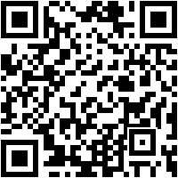
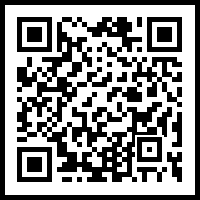
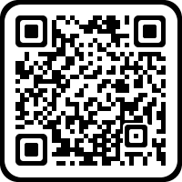

NiceQR
====

Cool Looking QR Code library based on [ZXing ("zebra crossing")](https://github.com/zxing/zxing).
Main features are:
- Colored QR Codes
- Rounded Borders
- Rounded Positional Elements
- Inside Logo

Usage
---

Artifacts are hosted on Bintray Jcenter. To use them add JCenter repository to 
your pom.xml
```
	<repositories>
		<repository>
			<id>bintray-jcenter</id>
			<name>bintray-jcenter</name>
			<url>https://jcenter.bintray.com</url>
		</repository>
	</repositories>
```

Then add NiceQR dependency

```
	</dependencies>
	...
		<dependency>
		    <groupId>org.lome</groupId>
		    <artifactId>niceqr</artifactId>
		    <version>0.1.0</version>
		</dependency>
	...
	</dependencies>
```

Samples
---

"Traditional" QR Code
```
		QrEngine.buildQrCode(text, 
				new File("samples/sample1.png"),
				QrConfiguration.builder()
				.withSize(200)
				.withRelativeBorderSize(.0)
				.withRelativeBorderRound(.0)
				.withDarkColor(Color.black)
				.withLightColor(Color.white)
				.withPositionalsColor(Color.black)
				.withRelativePositionalsRound(.0)
				.withCircularPositionals(false)
				.build());
```


Add some border to increase readability
```		
		QrEngine.buildQrCode(text, 
				new File("samples/sample2.png"),
				QrConfiguration.builder()
				.withSize(200)
				.withRelativeBorderSize(.05)
				.withRelativeBorderRound(.0)
				.withDarkColor(Color.black)
				.withLightColor(Color.white)
				.withPositionalsColor(Color.black)
				.withRelativePositionalsRound(.0)
				.withCircularPositionals(false)
				.build());
```


Round that border a bit
```
		QrEngine.buildQrCode(text, 
				new File("samples/sample3.png"),
				QrConfiguration.builder()
				.withSize(200)
				.withRelativeBorderSize(.05)
				.withRelativeBorderRound(.2)
				.withDarkColor(Color.black)
				.withLightColor(Color.white)
				.withPositionalsColor(Color.black)
				.withRelativePositionalsRound(.0)
				.withCircularPositionals(false)
				.build());
```


Round positional elements
```		
		QrEngine.buildQrCode(text, 
				new File("samples/sample4.png"),
				QrConfiguration.builder()
				.withSize(200)
				.withRelativeBorderSize(.05)
				.withRelativeBorderRound(.2)
				.withDarkColor(Color.black)
				.withLightColor(Color.white)
				.withPositionalsColor(Color.black)
				.withRelativePositionalsRound(.3)
				.withCircularPositionals(false)
				.build());
```


Add some colors
```		
		QrEngine.buildQrCode(text, 
				new File("samples/sample5.png"),
				QrConfiguration.builder()
				.withSize(200)
				.withRelativeBorderSize(.05)
				.withRelativeBorderRound(.2)
				.withDarkColor(new Color(0x0063,0x000B,0x00A5))
				.withLightColor(Color.white)
				.withPositionalsColor(new Color(0x00F4,0x0014,0x0038))
				.withRelativePositionalsRound(.3)
				.withCircularPositionals(false)
				.build());
```


Use circles as positional elements
```		
		QrEngine.buildQrCode(text, 
				new File("samples/sample6.png"),
				QrConfiguration.builder()
				.withSize(200)
				.withRelativeBorderSize(.05)
				.withRelativeBorderRound(.2)
				.withDarkColor(new Color(0x0063,0x000B,0x00A5))
				.withLightColor(Color.white)
				.withPositionalsColor(new Color(0x00F4,0x0014,0x0038))
				.withCircularPositionals(true)
				.build());
```


Add a logo inside the QR Code
```		
		QrEngine.buildQrCodeWithLogo(text, 
				new File(logo),
				new File("samples/sample7.png"),
				QrConfiguration.builder()
				.withSize(200)
				.withRelativeBorderSize(.05)
				.withRelativeBorderRound(.2)
				.withDarkColor(new Color(0x0063,0x000B,0x00A5))
				.withLightColor(Color.white)
				.withPositionalsColor(new Color(0x00F4,0x0014,0x0038))
				.withCircularPositionals(true)
				.withRelativeLogoSize(.249)
				.build());
```


Warnings
---
This library is provided as-is.
Please make sure to test the readability of generated QR Codes before distributing them.

